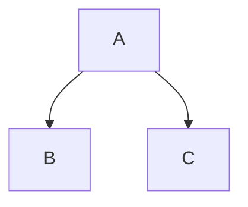

# Adding diagrams

Diagrams can be added directly inside the markdown files.

## PlantUML

To add a PlantUML diagram, simply type the PlantUML code inside the PlantUML tags `@``startuml` and `@enduml`
or add inline code with the plantuml! directive. See the link at the end of this page for the source.


@startuml
Alice -> Bob: Hi
Bob --> Alice: Hi there, [[https://costateixeira.github.io/documentation colleague]].
@enduml


```plantuml!
Alice -> Bob: Hi again
Bob --> Alice: Hi there, again! 
Alice -> Bob: Well, I'm heading back [[https://costateixeira.github.io/documentation home]]
```


You can also add mermaid diagrams, using the mermaid! directive in inline code




